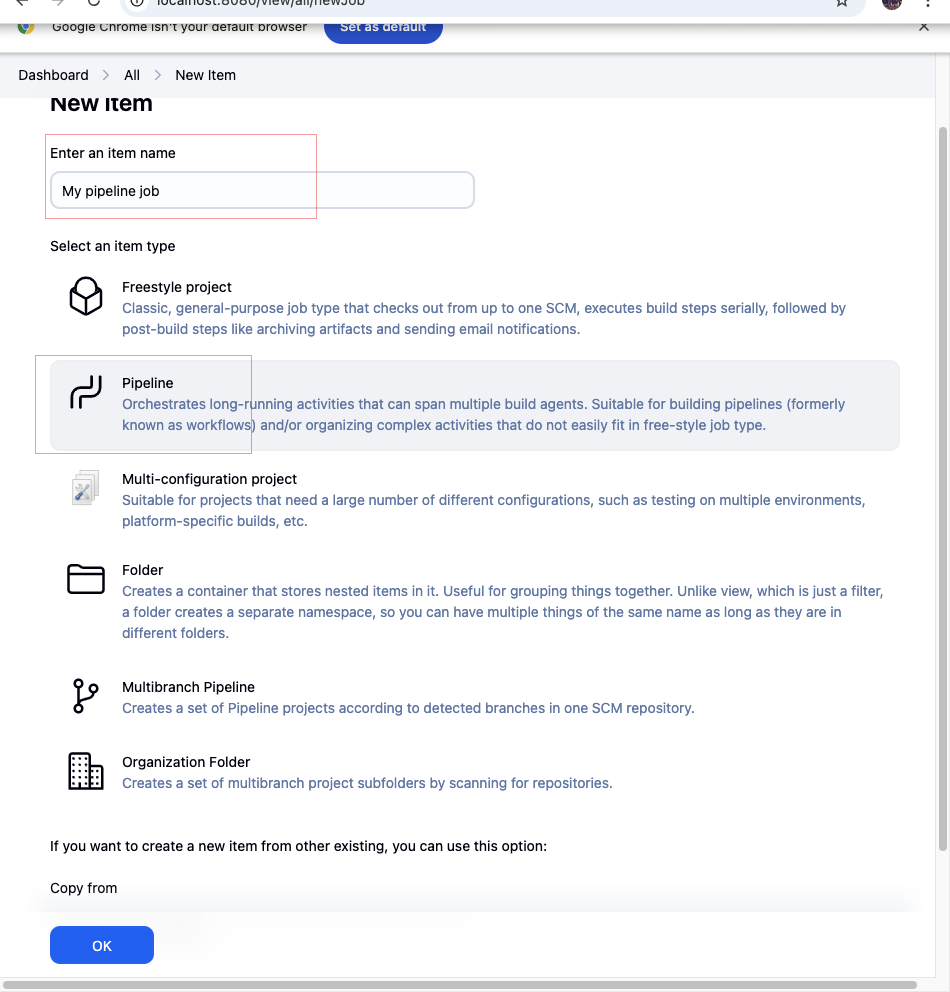

# Jenkins-Pipeline-Job

Repository for Jenkins Pipeline Job

## PROJECT OVERVIEW 

- The objective of this project is to automate the software delivery process using Jenkins pipeline jobs. The project aims to create a continuous integration and continuous delivery (CI/CD) pipeline that can build, test, and deploy software applications.

## Project Goals

Automate the build, test, and deployment process using Jenkins pipelines.
Demonstrate how to set up and configure a Jenkins pipeline job from scratch.
Integrate Docker into the CI/CD workflow for containerized deployments.
 Provide step-by-step visual documentation for the entire process.

## 1. Create New Jenkins Item

# Starting a new Jenkins job by selecting "New Item" from the dashboard

  

# 2. Configure Job Type

# Choosing the type of Jenkins job to create, such as a Pipeline.
  

# 3. Configure Build Triggers

## Setting up build triggers to automate when the pipeline runs.

  

# 4. Add Pipeline Script

# Entering the pipeline script that defines the build and deployment steps.

  

# 5. Open Pipeline Syntax Generator

# Accessing the Pipeline Syntax tool to help generate pipeline code snippets.
  

# 6. Use Pipeline Syntax Generator

## Using the syntax generator to create custom pipeline steps.
  

# 7. Generate Pipeline Script

# Generating and copying the pipeline script for use in the job configuration.

  

# 8. Create Docker Script

# Writing a shell script (`docker.sh`) to automate Docker installation or commands.

  

# 9. Docker Installation Script

# Detailed script for installing Docker on the build agent.

  

# 10. Docker Installation Error

# Encountering an error during the Docker installation process.

  

# 11. Create Dockerfile

# Creating a `Dockerfile` to define the application's container image.

  

# 12. Dockerfile Script

# Contents of the `Dockerfile` used for building the Docker image.

  

# 13. Create Index Page

# Adding an `index.html` file to serve as the application's homepage.

  

# 14. Index Page Script

# The HTML code for the congratulatory message in `index.html`.

# 15. Push and Commit Changes

# Committing and pushing changes to the version control repository.

  

# 16. Successful Pipeline Execution

# Final confirmation that the pipeline ran successfully and the application is working as expected.

  

## Project Summary

This project demonstrates how to set up a complete CI/CD pipeline using Jenkins. It guides users through creating a Jenkins pipeline job from scratch, configuring automated build triggers, integrating Docker for containerized deployments, and managing source code with version control. The README provides step-by-step visual documentation, making it easy for anyone to replicate the process and achieve automated, reliable software delivery.